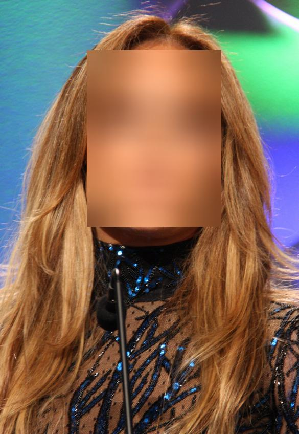
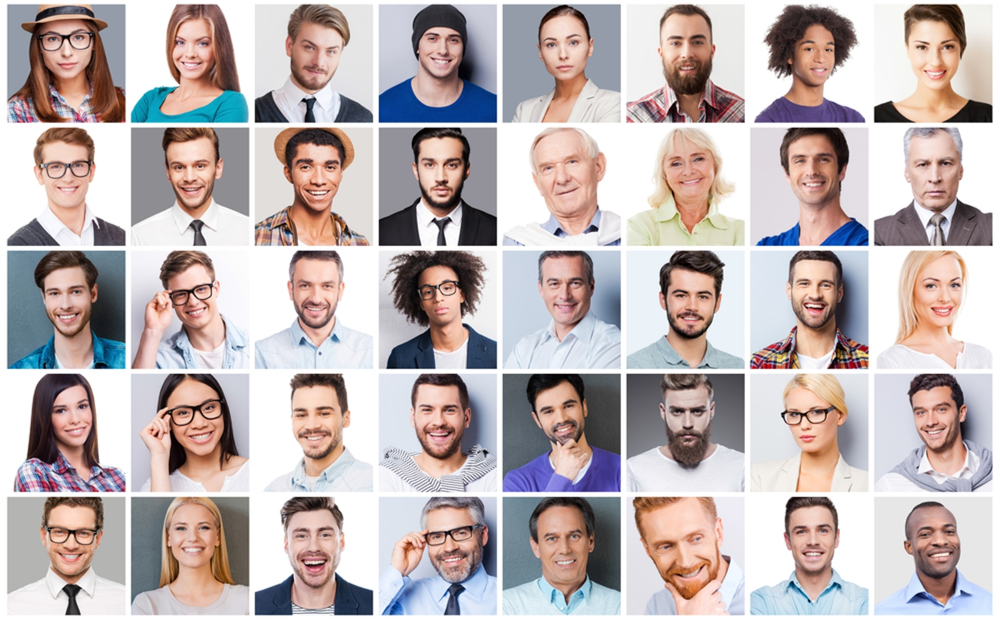
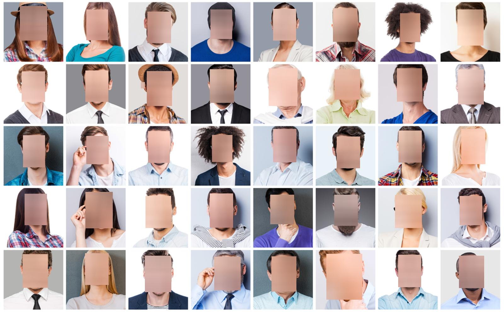

# Automatic Face Blur

## Blur faces in images
### Blurs faces present in images from a given directory

## This work uses a pre-trained face localizer model, **_MTCNN_**
*  The pre-trained model: [davidsandberg/facenet](https://github.com/davidsandberg/facenet)
* The paper: [Joint Face Detection and Alignment using   Multi-task Cascaded Convolutional Networks](https://kpzhang93.github.io/MTCNN_face_detection_alignment/paper/spl.pdf)

The **_MTCNN_** model utilizes **three** neural networks in cascade:
1. Proposal Net: `pnet`
2. Refinement Net: `rnet`
3. Output Net: `onet`

**_Note_**_: each one of the networks has an associated threshold. The thresholds filter the networks' output, since each network yields a level of confidence for each prediction (face localization). See function _mtcnn_localize_faces_ in **_blur_face.py_**_

## Examples
### Single face in image
| | |
|:-------------------------:|:-------------------------:|
| Input image| Output Image|
_Input image source: [Wiki](https://en.wikipedia.org/wiki/Jennifer_Lopez#/media/File:Jennifer_Lopez_at_GLAAD_Media_Awards_(cropped).jpg)_
### Mutiple faces in images
| | |
|:-------------------------:|:-------------------------:|
| Input image| Output Image|
_Input image source: in [Terrorist or criminal? New software uses face analysis to find out](https://www.israel21c.org/new-face-profiling-software-identifies-terrorists-and-criminals) from Shutterstock.com_
## Usage
#### You may change the networks' thresolds by editing the code directly
### Options
* `-id`(str) [default `./images`] input directory containing images
* `-od` (str) [default `./blurs`] output directory 
* `--b` (float) [default `99`] gaussian blur variance